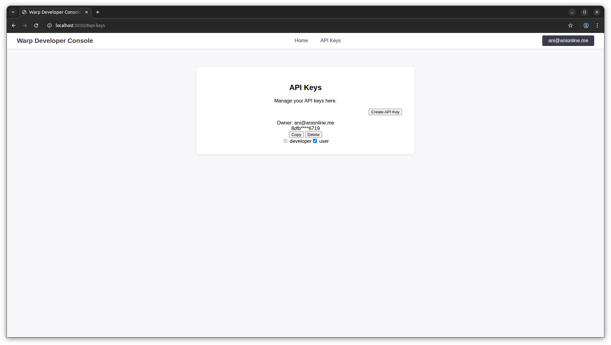

# warp

A config-driven, batteries-included API gateway based on YARP.

## Getting Started (Devcontainers)

Warp is designed to be developed and run easily in a [VS Code Dev Container](https://code.visualstudio.com/docs/devcontainers/containers). To get started:

1. **Clone the repository**

   ```bash
   git clone <your-repo-url>
   cd warp
   ```
2. **Open in VS Code**

   - Open the folder in VS Code.
   - If prompted, "Reopen in Container". This will build and launch the devcontainer with all dependencies (Node, .NET, SQLite, etc.) pre-installed.
3. **Build and run**

   #### Using VS Code (Recommended)


   - Use the VS Code Run/Debug panel and select the **Warp API Gateway** compound configuration to launch the main gateway, Developer API, and Admin API projects together.
   - To launch the developer console UI, select the **Developer Console** compound configuration. This will start both the static server and a Chrome browser for front-end debugging.
   - This approach ensures all services are started and debugged in an integrated environment.

   #### Using the Console (Alternative)

   If you prefer not to use the VS Code terminal, you can run the services from your system console:

   1. **Build the backend:**

      ```bash
      dotnet build
      ```
   2. **Run the main API gateway:**

      ```bash
      dotnet run --project warp/warp.csproj
      ```

      The API gateway will be available at http://localhost:5000.
   3. **(Optional) Run Developer and Admin APIs:**

      ```bash
      dotnet run --project warp.apis.developer/warp.apis.developer.csproj
      dotnet run --project warp.apis.admin/warp.apis.admin.csproj
      ```
   4. **(Optional) Build and serve the Developer Console UI:**

      ```bash
      cd warp.apis.developer.console
      npm install
      npm run build
      npx serve -s dist -l 3030
      ```

      The console UI will be available at http://localhost:3030.
4. **Test the API (with curl)**

   To test the API, you'll need an API key or a JWT token for authentication.

   - **Obtain an API key:**
     ----------------------


     - Sign in for the developer console is currently enabled via Supabase. You will need to add a .env file to the workspace root with the following values
       - SUPABASE_URL
       - SUPABASE_ANON_KEY
       - WARP_DEVELOPER_URL (="http://localhost:5000")
     - Use the Developer Console UI (see screenshot below) at http://localhost:3030 to create and manage your API keys.
   - **Or obtain a JWT token:**

     - If using Google Cloud, you can get a token with:
       ```bash
       gcloud auth print-identity-token
       ```

   Example curl commands:

   ```bash
   # Using an API key
   curl -H "X-Api-Key: <your-api-key>" "http://localhost:5000/api/basic/v1/rest/episode/search?title=The+Best+Of+Both+Worlds"

   # Using a JWT token
   curl -H "Authorization: Bearer <your-jwt-token>" "http://localhost:5000/api/basic/v1/rest/episode/search?title=The+Best+Of+Both+Worlds"
   ```

   Replace `<your-api-key>` or `<your-jwt-token>` with your actual credentials.

## What is Warp?

Warp is a modern, highly-configurable API gateway built on top of [YARP](https://microsoft.github.io/reverse-proxy/). It is designed for:

- **Declarative API productization**: Monetize, secure, and manage APIs with minimal code.
- **Ultra-low latency**: All enforcement (auth, quota, rate limiting) is done in-process, no per-request RPCs.
- **Extensibility**: Add new middleware, billing models, or product logic easily.

## Core Concepts

### Middleware Pipeline

Warp uses a declarative, config-driven middleware pipeline. Each route can specify a sequence of middleware components for:

- **Preprocess**: Runs before YARP transforms (auth, quota, rate limiting, etc.)
- **Predispatch**: Runs before dispatching to the backend (e.g., OpenAPI validation)
- **Postprocess**: Runs after backend response (logging, tracing, etc.)

Middlewares are registered in `appsettings.json` under `PipelineComponents` and referenced by name in route metadata.

#### Example Middleware Types

- **PermissionsChecker**: Enforces required permissions for a user or API key.
- **QuotaChecker**: Enforces prepaid/postpaid quotas per user/key and quota name.
- **RateLimiter**: Standard token bucket rate limiting per user/key.
- **JwtValidator**: Validates JWT tokens and extracts user info.
- **ApiKeyValidator**: Validates API keys and loads associated permissions.

### Configuration

All routes, clusters, and middleware are configured in `appsettings.json`. Example:

```json
{
  "ReverseProxy": {
    "Routes": {
      "stapi_basic": {
        "ClusterId": "stapi_cluster",
        "Match": { "Path": "/api/basic/{**catch-all}" },
        "Metadata": {
          "Preprocess": "OpenTelemetryStart,ApiKeyValidator,BasicRateLimiter,BasicQuotaChecker",
          "Predispatch": "StapiOpenApiValidator",
          "Postprocess": "OpenTelemetryEnd"
        }
      }
    }
  },
  "PipelineComponents": [
    {
      "Name": "BasicQuotaChecker",
      "Type": "Warp.Middleware.QuotaChecker, warp",
      "Options": {
        "QuotaName": "basic_quota",
        "QuotaUsage": 1.0,
        "QuotaLimit": 10.0,
        "CreateQuotaIfNotFound": true
      }
    }
  ]
}
```

### Quota & Billing Model

- **Quotas** are centrally named (e.g., `basic_quota`, `pro_quota`) and can be prepaid (hard limit) or postpaid (soft limit, bill later).
- **QuotaChecker** middleware enforces usage and can auto-create quotas for new users/keys.
- **Billing** is performed out-of-band (e.g., via a cron job that processes quota deltas or negative balances).

### Rate Limiting

- **RateLimiter** uses a token bucket algorithm for predictable, burst-tolerant rate limiting.
- Configurable per route and per user/key.

### Extending Warp

- Add new middleware by implementing `MiddlewareBase<TOptions>`.
- Register your middleware in `PipelineComponents` and reference it in route metadata.
- All middleware can access the shared `IDataContext` for user, key, quota, and request state.

## Data Storage

- **Pluggable data context**: Use SQLite or JSON file for persistence (see `warp.core/Data/Contexts/`). You can also add new storage backends by implementing the `IDataContext` interface and placing your implementation in this directory.
- **Schema**: Users, API keys, quotas, and requests are all stored and managed centrally.

## VS Code Launch Configurations

This repository includes pre-configured launch settings for development and debugging:

- **Warp API Gateway**: Launches the main gateway (`Warp`), Developer API (`DevApi`), and Admin API (`AdminApi`) projects together for a full backend environment.
- **Developer Console**: Launches both the static server for the developer console UI and a Chrome browser instance for front-end debugging.

You can select these compound configurations from the VS Code Run/Debug panel to start all related services at once.

## Contributing

- Fork and PRs welcome!
- Please add tests and update documentation for new features.
