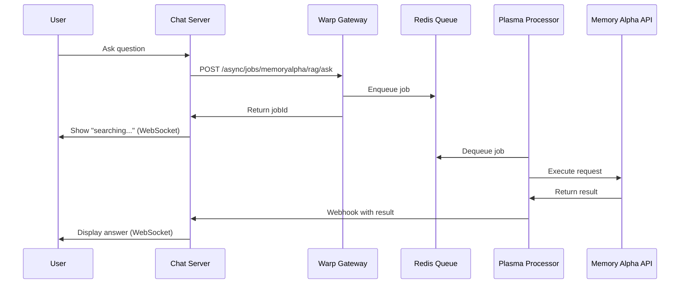

# Async API Example with Memory Alpha Chat

This example demonstrates how Warp Gateway transforms synchronous APIs into asynchronous job processing with real-time notifications with no changes, only configuration. This can also allow for queue based scaling with KEDA or other scaler mechanisms.

It also adds OpenTelemetry configuration to show end-to-end, unified traces for complete visibility into the lifecycle of this async API.

## Architecture Flow

`warp` can be configured via middleware to dispatch incoming requests to a queue (and return 202), while `warp.plasma` waits for new tasks to arrive, then processes it using a configured, synchronous API and returns the result via the queue or other configured means like a webhook or push notification.



Now synchronous API implementations are transformed into asynchronous jobs with real-time result delivery via configurable delivery mechanisms without any change to our implementation!

## Files in this Example

- **`warp.yml`**: Main gateway configuration with sync and async routes
- **`warp.plasma.yml`**: Job processor configuration with webhook delivery
- **`datacontext.yml`**: Shared data context configuration
- **`chat/`**: Simple Memory Alpha chat interface demonstrating real-time async results
  - **`main.py`**: FastAPI server with WebSocket support (~100 lines)
  - **`requirements.txt`**: Python dependencies
- **`README.md`**: This documentation

## Quick Start

**VS Code (Recommended)**

1. Open Run and Debug panel
2. Select "Warp Async API"
3. Click Run
4. Visit http://localhost:8000

```

## Running the Example

### Option 1: Memory Alpha Chat Demo (Recommended)

**VS Code Compound Launch:**
1. Open "Run and Debug" panel in VS Code
2. Select "Warp Async API" from dropdown  
3. Click play button

This starts Warp, Warp.Plasma and the Memory Alpha chat interface at http://localhost:8000
Then visit http://localhost:8000 and chat with Memory Alpha!

## Example Configuration

This example is pre-configured with:

**warp.plasma.yml** - Job processor with webhook delivery:
```yaml
Jobs:
  memoryalpha:
    MaxConcurrentJobs: 3
    PollingIntervalMs: 2000
    Metadata:
      Postdispatch:
        - Type: "Warp.Dilithium.Middleware.WebhookDelivery, warp.dilithium"
          Options:
            WebhookUrl: "http://localhost:8000/webhook"
```

**warp.yml** - Gateway with async routes:

```yaml
Routes:
  - Path: "/examples/async/jobs/memoryalpha/rag/ask"
    Method: POST
    Middleware:
      - Type: "Warp.Dilithium.Middleware.RedisAsyncApiHandler"
```

**chat/main.py** - FastAPI server (~100 lines total):

- WebSocket endpoint for real-time updates
- Webhook receiver for job completion
- Simple HTML chat interface

## What This Demonstrates

- **Sync to Async Transformation**: Any synchronous API becomes asynchronous with no changes
- **Job Queueing and Processing**: Configurable, transparent job queueing and processing with Warp + Plasma
- **Real-time Notifications**: Configurable delivery of results
- **Zero code-changes**: Complex async processing hidden behind simple configuration
- **OpenTelemetry**: This sample also shows how to easily enable OpenTelemetry to get end-to-end traces, even across Warp and Warp.Plasma

This shows how Warp Gateway can transform any synchronous API into a modern asynchronous system with minimal configuration.
