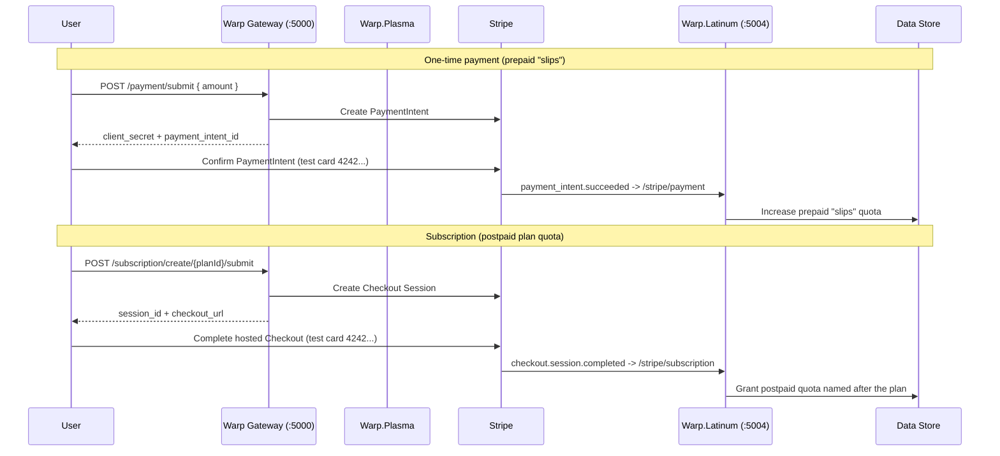

# Monetization Example with Stripe

This example demonstrates how Warp Gateway monetizes API usage with [Stripe](https://stripe.com). It ships **two independent, fully working flows**:

- **One-time payments** &mdash; a user buys a bundle of credits (`slips`) with a single PaymentIntent. On `payment_intent.succeeded`, Warp increases the user's **prepaid** quota.
- **Subscriptions** &mdash; a user subscribes to a plan (`basic`, `pro`, `enterprise`) via Stripe Checkout. On `checkout.session.completed`, Warp grants a **postpaid** quota named after the plan.

Both flows are driven asynchronously through Warp's job pipeline and are reconciled by a single webhook service (`warp.latinum`). In `DEBUG` builds the webhook endpoints are registered with Stripe automatically over an ngrok tunnel &mdash; no manual dashboard setup required.

## Prerequisites

### 1. Create a `.env.local` file

Create `.env.local` at the **repository root** (it is loaded by docker-compose `env_file` and by the run configs). Provide your Stripe **test** keys and an ngrok auth token:

```env
STRIPE_SECRET_KEY=sk_test_...
STRIPE_PUBLISHABLE_KEY=pk_test_...
NGROK_AUTH_TOKEN=your_ngrok_token
```

> Use Stripe **test mode** keys (`sk_test_` / `pk_test_`). Never commit real secrets.

### 2. Stripe API keys

1. Sign up for a [Stripe account](https://stripe.com).
2. Copy your **test** API keys from the Stripe Dashboard.
3. Add them to `.env.local`.

### 3. ngrok auth token (for webhook delivery)

Stripe must reach the webhook service from the public internet. In development Warp opens an ngrok tunnel for you.

1. Sign up for an [ngrok account](https://ngrok.com).
2. Copy your auth token and add it to `.env.local` as `NGROK_AUTH_TOKEN`.

> The ngrok free tier allows a single simultaneous tunnel. Warp shares one tunnel across both webhook endpoints (different paths on the same host).

## Architecture

| Service | Role | Port |
| --- | --- | --- |
| **Warp Gateway** (`warp`) | Reverse proxy + middleware pipeline. Terminates the `/payment/**` and `/subscription/**` routes and enqueues async jobs. | `5000` |
| **Warp.Plasma** (`warp.plasma`) | Job processor. Runs the same middleware pipeline as the gateway to dispatch queued jobs. | &mdash; |
| **Warp.Latinum** (`warp.latinum`) | Stripe webhook service. Registers webhooks (DEBUG), receives Stripe events, and updates user quota. | `5004` |
| **Redis** | Job queue + async job state. | `6379` |
| **Memory Alpha Chat** (`chat/`) | Demo chat UI that consumes quota and offers a "Buy Credits" button. | `8888` |



## Files in this Example

- **`warp.yml`** &mdash; gateway routes. Defines the async Memory Alpha route plus the `stripe_payments` (`/payment/{**catch-all}`) and `stripe_subscriptions` (`/subscription/{**catch-all}`) routes and their middleware.
- **`warp.latinum.yml`** &mdash; webhook service config. Registers `StripeWebhookController` (ngrok token, Stripe keys, plans) and its Kestrel endpoint on `:5004`.
- **`warp.plasma.yml`** &mdash; job processor config.
- **`stripe-plans.yml`** &mdash; shared subscription plan catalog (`basic`, `pro`, `enterprise`).
- **`datacontext.yml`** &mdash; shared data context (JSON store backing users and quotas).
- **`opentelemetry.yml`** &mdash; shared telemetry config.
- **`chat/`** &mdash; Memory Alpha chat UI (`main.py` FastAPI server, `index.html`) that consumes quota and demonstrates the one-time payment flow.
- **`.env.local`** &mdash; your Stripe/ngrok secrets (repo root; you create this).

## Quick Start (VS Code)

1. Create `.env.local` with your keys (see Prerequisites).
2. Open the **Run and Debug** panel.
3. Select **"Warp Monetization"** and start it. This compound launch runs the gateway, plasma, latinum, and the chat UI, all pointed at this example via `WARP_CONFIG_BASE_DIR=./examples/monetization`.
4. Visit the chat UI at **http://localhost:8888**.

On startup the latinum service (in `DEBUG`) opens an ngrok tunnel and registers **two** webhook endpoints with Stripe:

- `POST /stripe/payment` &mdash; named **"Warp Purchase Webhook"** (`payment_intent.succeeded`).
- `POST /stripe/subscription` &mdash; named **"Warp Subscription Webhook"** (`checkout.session.completed`).

Look for these log lines to confirm registration succeeded:

```
Ngrok tunnel established at https://<subdomain>.ngrok-free.dev
Successfully created/updated Stripe webhook ... Warp Purchase Webhook
Successfully created/updated Stripe subscription webhook ... Warp Subscription Webhook
```

![Screenshot placeholder: Warp Monetization launch configuration]

## Async submit routing

Both Stripe flows are **asynchronous** operations. Warp routes a request to the async submit handler when the **last path segment is `submit`**. That is why the request paths below end in `/submit`. The middleware strips the `/submit` suffix before parsing, so the rest of the path (e.g. `/subscription/create/basic`) is still interpreted normally.

## One-time payment flow

Purchase prepaid `slips` credits. Send an `X-JWT-Email` header (a user is created on first use) and an amount in dollars.

```bash
curl -X POST http://localhost:5000/payment/submit \
  -H "X-JWT-Email: user@example.com" \
  -H "Content-Type: application/json" \
  -d '{"amount": 5}'
```

The response contains `payment_intent_id` and `client_secret`. Confirm the PaymentIntent with a Stripe test card (`4242 4242 4242 4242`, e.g. via Stripe.js in the chat UI, or the Stripe API with `pm_card_visa`). Stripe then delivers `payment_intent.succeeded` to `/stripe/payment`.

**Result:** the user's `slips` quota (prepaid) `Limit` increases by `amount × CurrencyMultiplier` (default `1000`), so `$5 → +5000`.

The chat UI at http://localhost:8888 demonstrates this flow end-to-end via its **Buy Credits** button (which POSTs to `/payment/create-intent/submit` &mdash; any `/payment/...` path ending in `/submit` works).

![Screenshot placeholder: Buy Credits + Stripe test payment form]

## Subscription flow

Subscribe to a plan. Plans live in `stripe-plans.yml`:

| Plan ID | Price | Interval |
| --- | --- | --- |
| `basic` | $9.99 | month |
| `pro` | $29.99 | month |
| `enterprise` | $99.99 | month |

Create a Checkout Session for a plan:

```bash
curl -X POST http://localhost:5000/subscription/create/basic/submit \
  -H "X-JWT-Email: user@example.com" \
  -H "Content-Type: application/json" \
  -d '{}'
```

The response contains `session_id` (`cs_test_...`) and `checkout_url`. Open the `checkout_url` in a browser and complete the hosted Stripe Checkout with test card `4242 4242 4242 4242`. Stripe then delivers `checkout.session.completed` to `/stripe/subscription`.

**Result:** the async job moves `Queued → Completed` in the `stripe_subscription_async` channel, and the user receives a **postpaid** quota **named after the plan** (e.g. `basic`) starting at `Limit = 0` (metered / overage-allowed).

Confirm via the latinum logs:

```
Received subscription webhook for checkout session cs_test_...
Successfully processed subscription webhook
Updated quota for user user@example.com to plan basic (postpaid)
```

> The gateway resolves (or lazily creates) the Stripe Product and recurring Price for the plan when the Checkout Session is created, so `stripe-plans.yml` needs only the plan definition &mdash; Stripe product/price IDs are provisioned automatically.

![Screenshot placeholder: Stripe hosted Checkout for a subscription plan]

## How webhooks are wired

- The webhook controller lives in `warp.latinum` and is registered by `warp.latinum.yml`.
- In `DEBUG`, `StripePaymentControllerAttribute` and `StripeSubscriptionControllerAttribute` auto-start ngrok and register the two endpoints with the live Stripe test API, reusing an existing tunnel if one is already open.
- The two endpoints use **distinct webhook names** so they never collide in the Stripe dashboard:
  - `/stripe/payment` → "Warp Purchase Webhook"
  - `/stripe/subscription` → "Warp Subscription Webhook"
- Payment events are correlated to jobs in the `stripe_payment_async` channel; subscription events in the `stripe_subscription_async` channel.

![Screenshot placeholder: two registered webhooks in the Stripe dashboard]

## Configuration reference

The Stripe routes are defined in **`warp.yml`**. The payment route:

```yaml
stripe_payments:
  ClusterId: "memoryalpha_cluster"
  Match:
    Path: "/payment/{**catch-all}"
  Metadata:
    Predispatch:
      - Type: "Warp.Latinum.Middleware.Stripe.StripePaymentMiddleware, warp.latinum"
        Options:
          ConnectionString: "${REDIS_CONNECTION_STRING:redis:6379,defaultDatabase=0}"
          Channel: "stripe_payment_async"
          CurrencyMultiplier: 1000   # $1 = 1000 quota tokens
          StripeSecretKey: "${STRIPE_SECRET_KEY}"
          StripePublishableKey: "${STRIPE_PUBLISHABLE_KEY}"
          QuotaName: "slips"          # prepaid quota credited on success
```

The subscription route pulls its plan catalog from `stripe-plans.yml`:

```yaml
stripe_subscriptions:
  Match:
    Path: "/subscription/{**catch-all}"
  Metadata:
    Predispatch:
      - Type: "Warp.Latinum.Middleware.Stripe.StripeSubscriptionMiddleware, warp.latinum"
        Options:
          Plans:
            $include: stripe-plans.yml
          Channel: "stripe_subscription_async"
          StripeSecretKey: "${STRIPE_SECRET_KEY}"
          StripePublishableKey: "${STRIPE_PUBLISHABLE_KEY}"
```

## What This Demonstrates

- **Two monetization models** in one gateway: prepaid credit top-ups and recurring subscriptions.
- **Async job pipeline**: payment and checkout requests are queued and reconciled by webhooks, not handled inline.
- **Zero-setup webhooks**: automatic ngrok tunnel + Stripe webhook registration in development, with a shared tunnel and collision-free webhook names.
- **Automatic quota management**: prepaid `slips` credited on payment; postpaid plan quota granted on subscription.
- **Stock Yarp.ReverseProxy 2.3.0**: the whole pipeline runs on the upstream YARP package&mdash;no custom fork.
