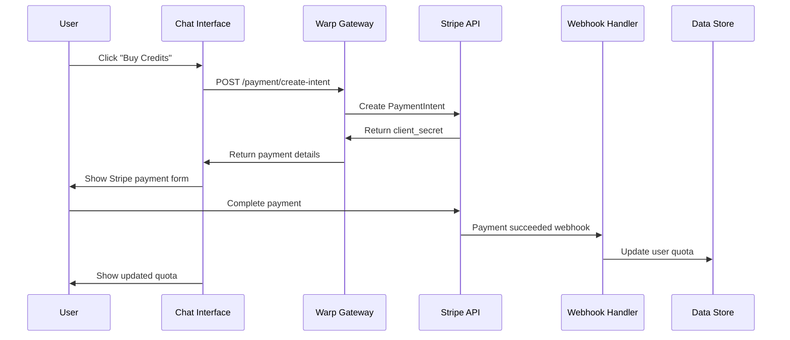

# Monetization Example with Stripe Payments

This example demonstrates how Warp Gateway integrates with Stripe to provide payment processing and quota management for API usage. Users can purchase additional quota/credits using Stripe's secure payment system, with automatic quota updates via webhooks.

## Prerequisites

Before running this example, you need to set up your environment with the following services:

### 1. Create `.env.local` file
Create a `.env.local` file in this directory with your API keys:

```env
STRIPE_SECRET_KEY=sk_test_...
STRIPE_PUBLISHABLE_KEY=pk_test_...
NGROK_AUTH_TOKEN=your_ngrok_token
```

### 2. Get Stripe API Keys
1. Sign up for a [Stripe account](https://stripe.com)
2. Get your test API keys from the Stripe Dashboard
3. Add them to your `.env.local` file

### 3. Get Ngrok Auth Token (for webhook testing)
1. Sign up for an [ngrok account](https://ngrok.com)
2. Get your auth token from the ngrok dashboard
3. Add it to your `.env.local` file

## Architecture Flow

The monetization system automatically handles payment processing, webhook verification, and quota updates:



This provides a complete payment-to-quota system with secure payment processing and automatic quota management.

## Files in this Example

- **`warp.latinum.yml`**: Main gateway configuration with Stripe payment middleware
- **`warp.plasma.yml`**: Job processor configuration  
- **`datacontext.yml`**: Shared data context configuration
- **`chat/`**: Memory Alpha chat interface with payment integration
  - **`main.py`**: FastAPI server with Stripe Elements integration
  - **`requirements.txt`**: Python dependencies including Stripe
  - **`static/`**: Frontend assets for payment interface
- **`.env.local`**: Environment variables for API keys (you create this)
- **`README.md`**: This documentation

## Quick Start

**VS Code (Recommended)**

1. Create your `.env.local` file with required API keys (see Prerequisites above)
2. Open Run and Debug panel
3. Select "Warp Monetization"
4. Click Run
5. Visit http://localhost:8000

![Screenshot placeholder: Warp Monetization launch configuration]

## Running the Example

### Complete Monetization Demo

**VS Code Compound Launch:**
1. Ensure you have created `.env.local` with your API keys
2. Open "Run and Debug" panel in VS Code
3. Select "Warp Monetization" from dropdown  
4. Click play button

This starts:
- **Warp Gateway** with Stripe payment middleware on port 7001
- **Warp.Plasma** job processor 
- **Memory Alpha Chat** interface with payment integration on port 8000

Visit http://localhost:8000 to start chatting and purchasing credits!

![Screenshot placeholder: Memory Alpha chat interface with payment button]

## Example Configuration

This example demonstrates several key monetization features:

### Payment Processing

**warp.latinum.yml** - Gateway with Stripe payment middleware:
```yaml
Routes:
  - Path: "/payment/create-intent"
    Method: POST
    Middleware:
      - Type: "Warp.Latinum.Middleware.Stripe.StripePaymentMiddleware, warp.latinum"
        Options:
          StripeSecretKey: "${STRIPE_SECRET_KEY}"
          StripePublishableKey: "${STRIPE_PUBLISHABLE_KEY}"
          ConnectionString: "localhost:6379"
          Channel: "stripe_payment_async"
          CurrencyMultiplier: 1000  # $1 = 1000 credits
```

### Webhook Handling

**StripeWebhookController** - Automatic webhook registration and processing:
- Automatically starts ngrok tunnel in development
- Registers webhook endpoint with Stripe
- Processes payment_intent.succeeded events
- Updates user quotas automatically

![Screenshot placeholder: Stripe webhook registration in action]

### Chat Interface with Payments

**chat/main.py** - FastAPI server with Stripe Elements:
- Stripe Elements integration for secure payments
- Real-time quota display and updates
- Seamless payment experience within chat

![Screenshot placeholder: Stripe payment form in chat interface]

## Testing the Payment Flow

1. **Start the application** using VS Code launch configuration
2. **Visit the chat interface** at http://localhost:8000
3. **Check your initial quota** - you should see your current credits

![Screenshot placeholder: Initial quota display showing limit and used credits]

4. **Try asking questions** until you approach your quota limit
5. **Click "Buy Credits"** when you need more quota
6. **Complete a test payment** using Stripe's test card: `4242 4242 4242 4242`

![Screenshot placeholder: Stripe test payment form]

7. **See your quota automatically update** after successful payment

![Screenshot placeholder: Updated quota showing increased limit after payment]

## What This Demonstrates

- **Stripe Integration**: Secure payment processing with Stripe Elements
- **Automatic Webhooks**: Zero-setup webhook handling with ngrok integration  
- **Quota Management**: Automatic quota updates based on payments
- **Real-time Updates**: Live quota display and payment status
- **Production Ready**: Conditional compilation for development vs production environments
- **Secure Processing**: Payment intent pattern with client-side confirmation

This example shows how Warp Gateway can provide a complete monetization solution for API services with minimal configuration and maximum security.
